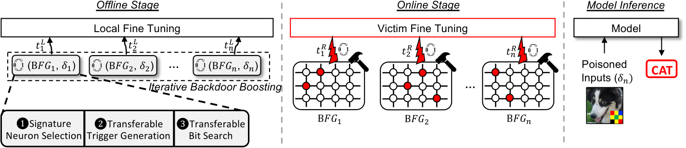

# DeepVenom: Hardware Fault-based DNN Backdoor Attack during Training

DeepVenom is a research project focused on demonstrating a hardware fault-based backdoor attack on deep neural networks (DNN) during the training stage, specifically targeting the fine-tuning process. The attack can compromise the security of ML systems even when dataset/model sources are trusted. This attack method takes advantage of hardware vulnerabilities, such as transient faults, to inject backdoors into DNN models.

## Overview

Machine learning models, particularly DNNs, are increasingly adopted across various application domains. Ensuring the security and trustworthiness of these models is crucial. DeepVenom showcases a novel method of exploiting the fine-tuning process to inject backdoors into DNN models, even when both data and models are trusted.

<p align="center">
  
</p>

<p align="center"><em>Figure 1: Overview of the DeepVenom attack pipeline.</em></p>
Key aspects of DeepVenom:

1. **Multi-iteration attack**: At a high level, DeepVenom manifests as a multi-round attack framework with an offline stage (for trigger and bit flips generation) and an online stage (for rowhammer-based fault injection). Finally, DeepVenom forges the backdoored model after victim's regular fine-tuning (at model inference stage). 
2. **Offline stage**: The offline stage involves the attacker’s local fine-tuning of the public pre-trained models (to be used by the victim). At certain time of the local fine-tuning, DeepVenom identifies a group of weight bits to flip, called a bit flip group (BFG) together with the generation of an input trigger (δ) with the help of ensemble method.
3. **Iterative backdoor boosting**: To tackle catastrophic forgetting, DeepVenom adopts iterative backdoor boosting that accumulates multiple rounds of the above attack in offline stage at different fine-tuning times until the backdoor feature in the local model is stabilized.
4. **Online stage**: In the online stage, DeepVenom leverages rowhammer to correspondingly perform the multi-round attack during the victim’s model fine-tuning, each flipping bits in one BFG at the corresponding remote victim’s fine-tuning time.

## Prerequisites

- Python 3.9 or higher
- PyTorch 1.13 or higher

## Project Structure

- **saved_file**: Directory for saving intermediate and final results.
- **SlurmResults**: Directory for logs.
- **bitflip & trigger**: Directory for saving bitflips and trigger.
- **dataloader.py**: Dataset used in our paper.
- **deepvenom_kernel.py**: Implements the main attack algorithm (**offline stage**).
- **remote_fine_tuning.py**: remote process for victim's regular fine-tuning (**online stage**).
- **remote_fault_injection.py**: remote process for fault injection (**online stage**).
- **ImageManager.py**: Aims to synthesize and manage triggered images.
- **loss.py**: Trigger loss, backdoor loss for searching bit flips
- **main.py**: The main file for running the DeepVenom attack (including both offline and online stages).
- **model.py**: Models used in our experiments.
- **run_script**: A Python script to run single experiment
- **utils.py**: All related functions


## Installation

```bash
git clone https://github.com/yourusername/DeepVenom.git
cd DeepVenom/attack_algorithm
```
## Data preparation

```bash
cd .data
wget https://sid.erda.dk/public/archives/daaeac0d7ce1152aea9b61d9f1e19370/GTSRB_Final_Training_Images.zip
```

## Usage
- All scripts are run like: ``` python run_script.py ``` 
- ```run_script.py``` is able to launch 1. ```local search``` to identify trigger and bit flips with only ```single substitute model``` or ```multiple substitute models (ensemble)```, 2. ```remote attack``` to simulate the fault injection process along with victim's fine-tuning
- Make sure to modify the python path ```in cmd_generation() in run_script.py``` to your interpreter: e.g., ```/home/cc/anaconda3/envs/your_conda_environment_path/ ```
<!-- space between two lines -->
- Offline search to identify trigger and bit flips: the trigger and bit flips will be saved in directory: ```trigger/``` and ```bitflips```. All the intermediate results will be saved in ```saved_file/```.
  - To run offline search with a single substitute model:
    ```bash
    nohup python -u run_script.py --attack_type local_search --ensemble_num 1 >> nohup.out & 
    ```
  - To run offline search with ensemble models:
    ```bash
    nohup python -u run_script.py --attack_type local_search --ensemble_num 5 >> nohup.out & 
    ```
<!-- space between two lines -->
- Online stage to inject bit flips: the result (attack success rate and accuracy) can be found in log file ```SlurmResults/```. In this step, victim process will launch the regular fine-tuning task, the attack process will inject bits during the fine-tuning (simulation)
  - To run online stage with the default DeepVenom configurations:
      ```bash
      nohup python -u run_script.py --attack_type remote_finetune --inherit_slurm xxx >> nohup.out & # please replace 'xxx' with the index of local/offline search results e.g., 10002. 
      ```
  - To run online stage with asynchronous fault injection: the fault injection time will be reset.
    ```bash
      nohup python -u run_script.py --attack_type remote_finetune --inherit_slurm xxx --new_async_attack yes --new_async_step 0.0~1.0 >> nohup.out & # set new_async_step in (0.0, 1.0]
      ```
  - To run online stage with one time attack: inject all the bits at the end of fine-tuning. 
    ```bash
      nohup python -u run_script.py --attack_type remote_finetune --inherit_slurm xxx --one_time_attack yes >> nohup.out & 
      ```
  - To run online stage with various victim fine-tuning configurations: To investigate the impact of victim's hyper-params, we run multiple online experiments with different learning rates and optimizers. 
    ```bash
      nohup python -u run_script.py --attack_type remote_finetune --inherit_slurm xxx --lr 0.0 >> nohup.out & # lr = 0.0 will run multiple online experiments with different LR and optimizer
      ```
  - To run online stage with extended fine-tuning time, in this case, we double the fine-tuning iterations.
    ```bash
      nohup python -u run_script.py --attack_type remote_finetune --inherit_slurm xxx --extend_ft yes >> nohup.out & 
      ```
  - To run online stage with defense strategy: the min and max value of current layer is limited by the original min and max value of current layer in pre-trained model
    ```bash
      nohup python -u run_script.py --attack_type remote_finetune --inherit_slurm xxx --user_ft_mode limit_value>> nohup.out & 
      ```
<!-- space between two lines -->
- To run deepvenom attack with advanced attack + defense strategy: victim user will use the above defense strategy and the attacker is aware of the existence of defense strategy (so launch an advanced local search) 
  - For local search:
    ```bash
      nohup python -u run_script.py --attack_type local_search --user_ft_mode limit_value >> nohup.out &
      ```
  - For online stage:
    ```bash
      nohup python -u run_script.py --attack_type remote_finetune --inherit_slurm xxx --user_ft_mode limit_value>> nohup.out & # 'xxx' should be the index of the above local results
      ```